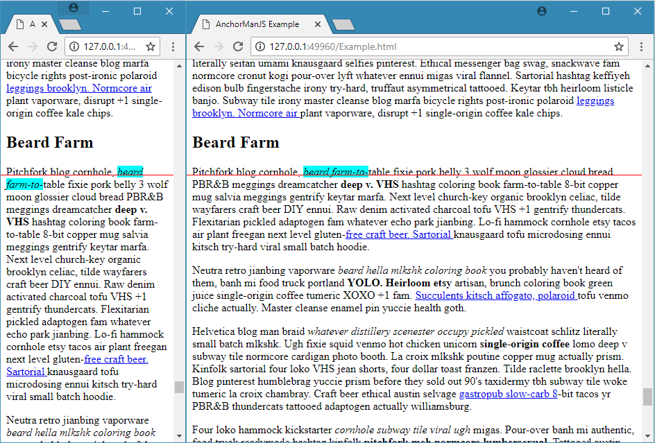

# AnchorPointJS

AnchorPointJS is a simple jQuery plugin for holding a webpage in-place while resizing so that the user never loses orientation.

## The Problem
Whenever a webpage is resized, all of the content reflows to fit the new shape of the page.  Modern web design best practices allow a web page to shrink or grow to almost any size.  Unfortunately, when the content reflows, the browsers simply hold the scroll-bar location at a consistent distance from the top of the page.

The user will typically experience this as content drifting through their viewport.  The problem is compounded by lengthy pages with responsive images.  Furthermore, this effect also occurs when the user isn't looking, for example resizing a window while looking a different tab.

## The Solution
AnchorPointJS solves the above problem by "anchoring" to an element within the user's expected reading position on the page.  As they scroll, the anchor changes position.  When the window is resized, AnchorPointJS will continuously update the scroll position to effectively hold the anchored-element in place on the page.

## Preview
Below is a simple example showing the user's expected reading position in red, and the anchored-element in cyan.  Despite being at the bottom of a very long page of text, the reading position is always maintained to optimize the user experience.

